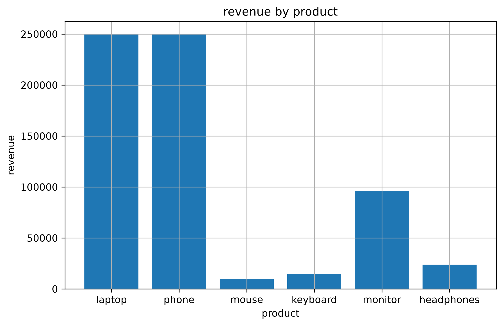
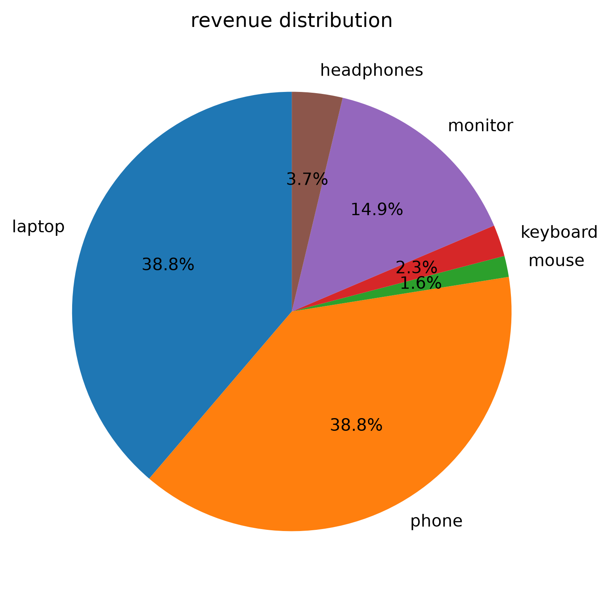

📊 Sales Data Analyzer

📖 About

A Python project that analyzes sales data using Pandas, NumPy, and Matplotlib.

🚀 Features

(1) Read sales data from a CSV file

(2) Calculate revenue

(3) Calculate total revenue

(4) Calculate total quantity sold

(5) Find the best-selling product

(6) Find the highest revenue product

(7) Generate bar charts

(8) Generate pie charts

(9) Export the analysis to a CSV report

🛠 Technologies Used

(1) Python

(2) Pandas

(3) NumPy

(4) Matplotlib

📂 Files

sales_data_analyzer.py

sales_data.csv

sales_report.csv

▶️ How to Run

Install the required libraries:

pip install pandas numpy matplotlib

Run the program:

python sales_data_analyzer.py

📈 Output

project output

revenue bar graph

revenue pie chart

👩‍💻 Author

SUBHIKSHA BALAMURUGAN 

Class 9 Student | Aspiring AI Engineer & Data Scientist | Learning Python, Data Science & AI
